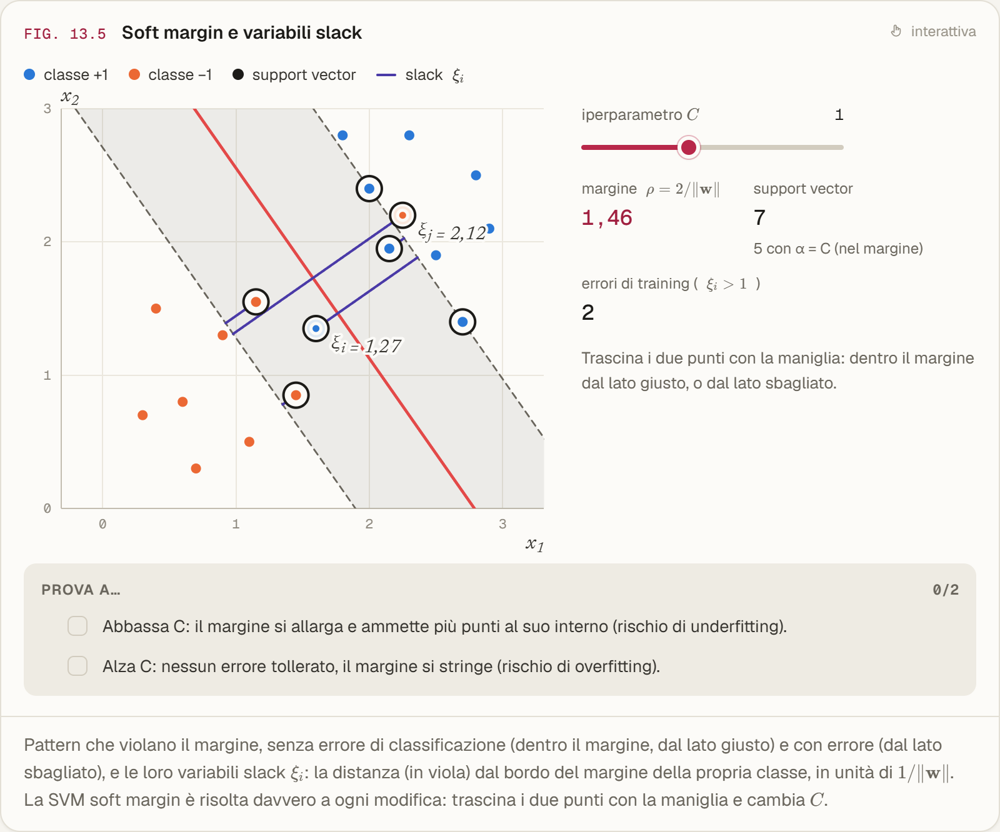

# Machine Learning — appunti interattivi

I miei appunti del corso di Machine Learning (654AA) del Prof. Alessio Micheli, Università di Pisa,
a.a. 2026/27, trasformati in un sito da leggere e da usare mentre si studia.

**https://fabiopsh.github.io/machine-learning-website-notes/**

Le figure degli appunti sono state rifatte da zero come grafici interattivi: si possono trascinare i punti,
cambiare gli iperparametri, far girare le superfici e, in alcune lezioni, vedere una rete neurale o una SVM
addestrarsi direttamente nel browser.


La superficie d'errore di un modello lineare: muovendo i pesi si vede la retta cambiare e il gradiente
indicare la direzione in cui l'errore scende.


Una SVM soft margin risolta a ogni modifica: spostando i punti o cambiando C si vedono margine, support
vector e variabili slack.



Due reti con e senza weight decay, addestrate all'apertura della pagina.


Le lezioni vengono aggiunte man mano. Il sito ha tema chiaro e scuro e uno stile alternativo "Liquid Glass",
si può cercare con `Ctrl K` e ha un glossario collegato alle lezioni.

## In locale

```bash
cd website
npm install
npm run dev
```

Gli appunti originali in Markdown sono in `notes/Appunti/`.

Se ti sono utili, lascia una stella alla repository.
